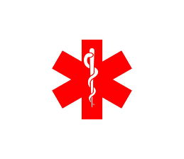

# SistemaHospitalario
Este Sistema Hospitalario hace la gestion de citas, recetas y facturas entre pacientes y medicos, además de los usuarios Administradores administrar los Medicamentos, Seguros y Especialidades disponibles en el sistema

## Entidades Usadas:

__Usuario:__ Usado para todos los tipos de usuarios donde se guardan los datos comunes, tiene una relación polimórfica uno a uno con Paciente, Medico, Administrador. __Almacena__ los campos _nombre_, _contrasena_, _email_, _telefono_ y _tipo_ 

__Paciente:__ Tiene una relacion polimórfica con la entidad Usuario, relación muchos a uno con Cita, Receta y Factura, además de una relación muchos a muchos con Seguro. 

__Medico:__ Tiene una relación polimórfica con la entidad Usuario, relación muchos a uno con Cita y Receta. __Almacena__ los campos _horaEntrada_ y _horaSalida_

__Administrador:__ Tiene una relación polimórfica con la entidad Usuario. __Almacena__ el campo _departamento_

__Cita:__ Tiene una relación uno a muchos tanto con Paciente como por Medico. __Almacena__ el campo _fecha_ y _motivo_

__Receta:__ Tiene una relación uno a muchos con Medico y con Paciente, además de estar relacionado con Medicamento mediante la entidad Posología. No almacena campos extras mas que la llave primaria y las referencias.

__Posologia:__ Entidad que sirven para relacionar Receta con Medicamento, se usa para indicar como debe de administrarse un medicamento según el medico al un paciente. __Almacena__ los campos _cantidad_, _frecuencia_, _fechaLimite_

__Factura:__ Tiene una relación uno a muchos con Paciente. __Almacena__ los campos _costos_, _serviciosPrestados_, _estado_ 

__Seguro:__ Tiene una relación muchos a muchos con Paciente. __Almacena__ los campos, _nombre_ y _cobertura_

__Medicamento:__ Tiene una relación muchos a muchos mediante con Receta mediante la entidad Posología. __Almacena__ los campos _nombre_, _descripción_ y _efectosSecundarios_

## Instalación

Primero se tiene que clonar el proyecto en un directorio local mediante el comando:

```bash
git clone https://github.com/juanpedrosimonaro/SistemaHospitalario
```

Luego hay que instalar las dependencias del proyecto mediante:

```bash
npm install
```

Para poder conectarse con la base de datos se tiene crear una archivo .env en donde se va a guardar los _secretos_. Aquí hay un ejemplo de lo que se podría guardar gracias a [ElephantSQL](https://www.elephantsql.com)

```bash
DATABASENAME=wcqtvtda
DBUSERNAME=wcqtvtda
DBPASSWORD=k658rbHNd-1JF53HycESKGfaiLT420iE
DBHOST=chunee.db.elephantsql.com
BDIALECT=postgres
```

Finalmente inicializar el proyecto mediante <code>npm start</code> o <code>nodemon</code>

## Rutas usadas en el Proyecto
Todos los endpoint usan el formato de recepción _x-www-form-encoded_, las rutas son gestionadas de acuerdo a los respectivos roles

### Ruta /auth

|**Subruta**|**Metodo**|**Descripción**|**Rol**|
| :- | :- | :- | :- |
|/iniciar-sesion|GET|Muestra el formulario de inicio de sesión|Invitado|
|/iniciar-sesion|POST|Realiza el inicio el inicio de sesión al crear un token dentro de la cookie del cliente|Invitado|
|/registro|GET|Muestra un formulario, para el registro de usuario y dependiente del tipo de usuario se mostrarán las demás opciones|Invitado|
|/registro|POST|Registra el usuario y dependiendo de tipo de usuario se registrará los demás datos en la respectiva entidad|Invitado|
|/cerrar-sesion|GET|Elimina el token de la cookie del cliente y lo redirige a pantalla de inicio de sesión|Cualquier Usuario|

### Ruta /administrador

|**Subruta**|**Metodo**|**Descripción**|**Rol**|
| :- | :- | :- | :- |
|/|GET|Accede al menú de opciones del Administrador|Administrador|
|/gestion-pacientes|GET|Muestra la gestión de los pacientes|Administrador|
|/editar-paciente|PUT|Edita los datos del paciente incluido el usuario relacionado|Administrador|
|/eliminar-paciente|DELETE|Elimina el paciente además del usario |Administrador|
|/gestion-medicos|GET|Muestra la página de gestión de médicos|Administrador|
|/editar-medico|PUT|Edita los datos del médico, así como el usuario relacionado|Administrador|
|/eliminar-medico|DELETE|Elimina al medico, así como al usuario relacionado|Administrador|
|/gestion-especialidades|GET|Muestra las opciones de especialidades|Administrador|
|/ingresar-especialidad|POST|Ingresa una nueva especialidad a la base de datos|Administrador|
|/editar-especialidad|PUT|Edita la especialidad|Administrador|
|/eliminar-especialidad|DELETE|Elimina la especialidad|Administrador|
|/gestion-seguros|GET|Mustra las opciones para la gestión de seguros|Administrador|
|/ingresar-seguro|POST|Ingresa el seguro en la base de datos|Administrador|
|/editar-seguro|PUT|Edita los datos del seguro|Administrador|
|/eliminar-seguro|DELETE|Eliminar el seguro|Administrador|
|/gestion-medicamentos|GET|Muestra las opciones de los medicamentos|Administrador|
|/ingresar-medicamento|POST|Ingresa el medicamento en la base de datos|Administrador|
|/editar-medicamento|PUT|Edita los datos del medicamento|Administrador|
|/eliminar-medicamento|DELETE|Elimina el medicamento|Administrador|


### Ruta /medico

|**Subruta**|**Metodo**|**Descripción**|**Rol**|
| :- | :- | :- | :- |
|/|GET|Muestra la página principal del médico, mostrando las las citas así como las recetas que ha emitido|Medico|
|/establecer-receta/:id|GET|Crear una receta para luego redirigir a la página para agregar las medicinas con su respectiva posología|Medico|
|/establecer-medicamento-receta/:id|GET|Muestra la pagina en el que se hará la gestión de los medicamentos que tiene la receta con su respectiva posología|Medico|
|/agregar-medicamento-receta/:id|POST|Ingresa el medicamento en la receta con su respectiva posología|Medico|
|/eliminar-medicamento-receta/:id|DELETE|Elimina el medicamento de la receta|Medico|
|/mostrar-receta/:id|GET|Muestra los medicamentos que lleva la receta con su respectiva posología|Medico|
|/establecer-factura/:id|GET|Muestra un formulario para la emisión de una factura|Medico|
|/establecer-factura/:id|POST|Emite una factura a un paciente de acuerdo a los servicios prestados|Medico|

### Ruta /paciente

|**Subruta**|**Metodo**|**Descripción**|**Rol**|
| :- | :- | :- | :- |
|/|GET|Muestra la página principal del paciente, donde se muestra las citas, las recetas emitidas por los medico así como las facturas|Paciente|
|/establecer-cita|GET|Muestra el formulario para la realización de una cita con el medico dependiendo de las horas disponibles|Paciente|
|/establecer-cita|POST|Realiza la cita con el médico|Paciente|
|/mostrar-factura/:id|GET|Muestra la factura del paciente|Paciente|
|/mostrar-receta/:id|GET|Muestra la receta con los medicamentos y su respectiva posología|Paciente|


